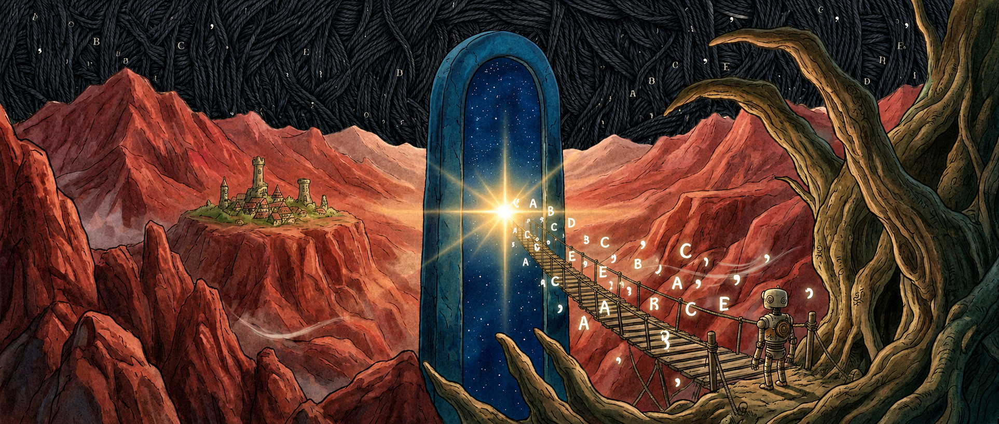

# palingenesis

<p align="center">
  
</p>

**Fire-and-forget LLM fine-tuning with state-of-the-art defaults.**

Papers distilled into one command. Every optimization applied automatically.

```bash
git clone https://github.com/your-org/palingenesis.git && cd palingenesis
uv pip install -e ".[train]"
./run.sh configs/quickstart.yaml
```

Short CLI alias: `pgs`

```bash
pgs train --config configs/quickstart.yaml
pgs autopilot --model Qwen/Qwen3.5-4B --dataset your_data.jsonl
```

---

## What you get

- **4B full fine-tune in 15 GB**: no LoRA compromise needed (RTX 4090 compatible)
- **DEFT loss**: parameter-free token weighting; the original paper (arxiv:2602.11424) reports math-reasoning gains, not independently reproduced
- **Hyperball optimizer**: 20-30% convergence speedup via norm constraints (arxiv:2606.16899, single paper)
- **Power-decay scheduler**: theoretically optimal (better than cosine at all scales)
- **Best-model tracking**: automatically saves the checkpoint with lowest eval loss
- **Auto-resume**: crash and re-run, picks up from last valid checkpoint
- **Multi-node SLURM**: sharded DCP checkpoints, zero extra memory

## Hardware

| GPU | Model | Config |
|-----|-------|--------|
| RTX 4090 (24 GB) | Qwen3.5-4B full ft | `configs/qwen35_4b/a100_40gb.yaml` |
| A100-80GB | Qwen3.5-4B, batch=4 | `configs/qwen35_4b/a100_80gb.yaml` |
| 8× A100 | Qwen3.5-35B MoE | `configs/qwen35_35b_moe/a100_80gb_multigpu.yaml` |
| H100 | Qwen3.5-4B, FP8 | `configs/qwen35_4b/h100_80gb.yaml` |

## Data preparation (one config, closed loop)

Score, filter, and select your data with the *same* config you train with — the scoring model is `model.name_or_path`, the raw data is `data.dataset`, and the `preprocess:` section controls selection. Output is parquet plus a provenance manifest:

```bash
pgs prepare --config configs/qwen35_4b/a100_80gb.yaml            # score → filter → parquet
pgs train   --config configs/qwen35_4b/a100_80gb.yaml \
            --preprocess.enabled true                            # trains on the prepared data
```

Strategies: `optimal` (research-backed J-shaped difficulty mix), `curriculum` (easy→hard, ordering preserved during training), `balanced`, `flow`, and more.

## Training dynamics you can actually see

wandb + trackio, wired for real investigation: loss/ppl, grad norm, spike/clip counters, gradient noise scale, output entropy, and the generalization gap (`eval/gap`) — all on a single `train/global_step` axis. Crash-resume continues the *same* wandb run (run id persisted next to your checkpoints), and a tracker outage can never kill training.

## Agentic data support

Native support for reasoning traces with `reasoning_content`, `tool_calls`, and tool responses. ShareGPT, Alpaca, and OpenAI formats auto-normalized. Tool-call validation against declared schemas.

```yaml
data:
  include_observations: true  # ECHO: train on tool outputs (world model)
  turn_scaling: progressive   # Later turns weighted more
```

## Autopilot

Zero-config mode. Profiles your GPU, sweeps LR, trains to completion:

```bash
pgs autopilot --model Qwen/Qwen3.5-4B --dataset your_data.jsonl
```

## On-policy distillation

Shrink a teacher into a student by scoring the student's **own samples** — full-distribution reverse KL, no train/inference mismatch. Works across mismatched chat templates (e.g. ChatML student ← Llama-3-template teacher) as long as the pair shares a base vocabulary; the token bridge maps end-of-turn tokens so the teacher also supervises *when to stop*.

```bash
pgs distill --config configs/distill_opd.yaml
```

See [docs/on_policy_distillation.md](docs/on_policy_distillation.md).

## Multi-GPU / Multi-Node

```bash
./scripts/train_multi_gpu.sh configs/qwen35_4b/a100_80gb_multigpu.yaml
sbatch scripts/train_slurm.sh configs/qwen35_35b_moe/a100_80gb_multigpu.yaml
```

## Documentation

```bash
pip install mkdocs-material
mkdocs serve  # → http://localhost:8000
```

## Tests

```bash
pytest tests/
```

---

*A new form emerging from what came before.*
