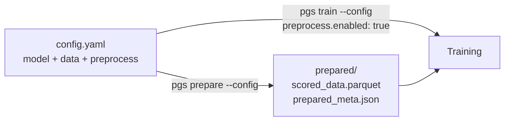

# Data Preparation

*The model can only learn from data at the edge of its capability. Too easy teaches nothing. Too hard overwhelms. Finding that edge is what preparation does.*

---

## The difficulty problem

Imagine teaching calculus. If every example is `2+2=4`, the student learns nothing new. If every example is a Millennium Prize problem, the student can't follow the reasoning. The optimal teaching material is *just beyond* current competence — hard enough to be informative, easy enough to be learnable.

Language models work the same way. A sample where the model already assigns 95% probability to the correct tokens provides almost zero gradient signal — the loss is near zero, the weights barely move. A sample where the model is completely lost (5% on everything) provides gradient, but in random directions that don't generalize.

The sweet spot is medium difficulty: samples where the model gets roughly 30-70% of tokens right. These produce strong, directional gradients that push the model toward useful generalizations.

Palingenesis finds this sweet spot automatically.

---

## The pipeline

=== "Config-driven (recommended)"

    One YAML drives everything. `pgs prepare` reads the **same config** you train with — the scoring model is `model.name_or_path`, the raw data is `data.dataset`, and the `preprocess:` section controls selection:

    ```bash
    pgs prepare --config configs/qwen35_4b/a100_80gb.yaml
    ```

    Then train — with `preprocess.enabled: true`, training automatically picks up the prepared parquet instead of the raw dataset:

    ```bash
    pgs train --config configs/qwen35_4b/a100_80gb.yaml --preprocess.enabled true
    ```

    The same `--section.field` overrides work here too:

    ```bash
    pgs prepare --config cfg.yaml --preprocess.budget 5000 --preprocess.strategy curriculum
    ```

=== "Standalone flags"

    The classic mode, no config file needed:

    ```bash
    pgs prepare \
        --model Qwen/Qwen2.5-3B-Instruct \
        --data my_data.jsonl \
        --output prepared/ \
        --budget 10000 \
        --strategy optimal \
        --format parquet
    ```

What this does, step by step:

1. **Score**: runs each sample through the target model, computes per-token perplexity using the model's own chat template to identify exactly which tokens are assistant responses
2. **Classify**: assigns each sample to easy/medium/hard based on percentile thresholds (adaptive to your data distribution)
3. **Filter**: removes trivial samples (PPL < 1.5 — the model already knows this perfectly) and impossible ones (PPL > 500 — noise, wrong language, corruption)
4. **Select**: picks an optimal subset within your budget
5. **Dump**: writes `scored_data.parquet` (order-preserving, fast to load) plus a `prepared_meta.json` manifest recording exactly which model, dataset, and strategy produced it

The scoring uses the *exact same masking* as training: only assistant tokens are measured. System prompts and user turns don't count. This is important — a long system prompt with a trivial answer would look "hard" by naive perplexity but is actually easy from the model's perspective.

---

## One config, closed loop

The preparation → training loop is fully wired through a single YAML. There is no way for the scoring model and the training model to drift apart, because they are the same field.



```yaml title="config.yaml (excerpt)"
model:
  name_or_path: Qwen/Qwen3.5-4B     # used for BOTH scoring and training

data:
  dataset: your-org/agentic-traces  # the RAW dataset to prepare
  max_seq_length: 16384             # same truncation in scoring and training

preprocess:
  enabled: true                     # training uses the prepared output
  output_dir: ./prepared/qwen35_4b
  format: parquet                   # parquet (default) or jsonl
  budget: 10000                     # samples to keep (0 = all)
  strategy: optimal                 # optimal | curriculum | balanced | flow | ...
  eval_holdout: 100                 # reserve a held-out eval set (never trained on)
```

!!! tip "Free held-out eval set"
    Set `eval_holdout: N` and prepare reserves N random samples (drawn **after** outlier filtering, **before** budget selection) into `eval_data.parquet`. They are guaranteed disjoint from the training data. If `data.eval_dataset` is left empty, training picks this file up automatically — giving you a genuine same-distribution eval, so `eval/loss`, `eval/ppl` and `eval/gap` actually measure generalization instead of memorization.

!!! tip "Provenance travels with the data"
    Every prepare run writes `prepared_meta.json` next to the data: scoring model, source dataset, strategy, sample count, perplexity statistics, and difficulty distribution. Training logs this manifest at startup, so every run records exactly which preparation produced its data.

!!! warning "No silent fallback"
    If `preprocess.enabled: true` but nothing has been prepared yet, training **fails immediately** with the exact command to run. It will never silently fall back to the raw dataset.

Two details worth knowing:

- **Curriculum ordering survives.** With `strategy: curriculum`, samples are stored easy→hard and training skips shuffling so the ordering reaches the model intact. Every other strategy shuffles normally.
- **Parquet is the default** because it preserves sample order, loads far faster than JSONL, and is consumed directly by the training data loader (you can point `data.dataset` at any `.parquet` file or prepared directory manually, too). If your samples have a schema Arrow can't unify, the writer falls back to JSONL automatically.

---

## The J-shaped distribution

The `optimal` strategy selects data with a difficulty distribution that research has converged on. Two properties make it robust across datasets:

1. **Difficulty is relative, not absolute.** Buckets are percentiles of the perplexity distribution *of your dataset as seen by your model* (bottom 25% = easy, top 25% = hard). A multilingual or domain-shifted dataset with high absolute PPL still gets a proper easy/medium/hard split — the J-shape always maps onto the difficulty range that's actually available.
2. **The mix adapts to your budget.** The Tsinghua scaling result (2605.12906) shows the optimal difficulty shifts harder as the data budget grows — small budgets need learnable data, large budgets can afford the hard tail:

| Budget | Easy | Medium | Hard | Very hard |
|--------|------|--------|------|-----------|
| < 2K samples | 35% | 50% | 15% | 0% |
| 2K–10K | 25% | 50% | 20% | 5% |
| > 10K | 20% | 50% | 25% | 5% |

If a bucket has fewer samples than its quota, the shortfall is backfilled from the other buckets (medium first) so you always get the full budget.

This isn't arbitrary. It synthesizes findings from three papers:

- Easy samples prevent forgetting (FLOW, ICML 2025): upweighting easy data preserves pretrained capabilities during SFT
- Medium samples maximize learning (InfoSFT, 2025): information content peaks at the model's decision boundary
- Hard samples are only useful with sufficient data budget (Tsinghua, 2026): at small data scales, easy dominates; at large scales, hard becomes valuable

The `optimal` strategy interpolates these findings into one distribution.

---

## Strategies

| Strategy | When to use | What it does |
|----------|------------|--------------|
| `optimal` | Default. Works best in most scenarios. | J-shaped difficulty mix |
| `balanced` | You want maximum diversity | Equal parts easy/medium/hard |
| `curriculum` | Multi-epoch training with progressive difficulty | Orders samples easy→hard |
| `hard_focus` | Strong base model + large dataset | Overweights challenging samples |
| `flow` | Anti-forgetting is your primary concern | Exponential weighting by easiness |

---

## Semantic packing (TFP)

Standard packing concatenates samples randomly into fixed-length sequences. But random concatenation wastes the cross-document context window — adjacent samples have no relationship, so the model can't do implicit few-shot learning within a packed sequence.

TFP (Threshold Filtering Packing) fixes this. It reorders samples so that semantically related — but not identical — conversations end up adjacent. During packing, they land in the same sequence. The model sees a related example before processing the current one, creating an implicit demonstration.

The algorithm:

1. Embed each sample with a lightweight sentence transformer (~22M params, fast)
2. Build a nearest-neighbor ordering via greedy TSP traversal
3. Apply a threshold filter: skip edges that are *too* similar (prevents redundant packs) or too dissimilar (loses the context benefit)

The threshold is the key insight. Pure nearest-neighbor would cluster identical samples together — that's bad (overfitting within packs). The filter ensures diversity: related enough for context, different enough for learning.

Result: +4-7% on benchmarks with zero runtime cost (ordering is done once during preparation).

```python
from palingenesis.tfp import compute_tfp_ordering
import json

# (if you prepared with format: parquet, load via datasets instead:
#  samples = list(load_dataset("parquet", data_files="prepared/scored_data.parquet", split="train")))
with open('prepared/scored_data.jsonl') as f:
    samples = [json.loads(l) for l in f]

texts = [s['messages'][-1]['content'] for s in samples]  # use assistant response for embedding
ordering = compute_tfp_ordering(texts, sim_threshold_low=0.2, sim_threshold_high=0.85)

with open('prepared/tfp_ordered.jsonl', 'w') as f:
    for idx in ordering:
        f.write(json.dumps(samples[idx]) + '\n')
```

Requires: `pip install sentence-transformers`

---

## Multi-source mixing

Real projects have multiple data sources: agentic traces, general instruction-following, code, reasoning. Each overfits at a different rate.

```yaml title="sources.yaml"
- dataset: ./agentic_traces.jsonl
  name: agentic
  weight: 0.65

- dataset: ./general_instruct.jsonl
  name: general
  weight: 0.20

- dataset: ./code_verified.jsonl
  name: code
  weight: 0.15
```

```bash
pgs prepare-multi --model Qwen/Qwen3.5-4B --sources sources.yaml --output prepared/
```

During training, enable MSFT adaptive weighting:

```yaml
data:
  msft_tracking: true
  msft_eval_every: 50
```

MSFT monitors per-source validation loss. When a source starts overfitting (val loss increases), its weight decays. When it improves, weight recovers. Weights never reach zero (floor at 10% of original) — the model always sees some of every source.

This prevents the common failure mode where one high-quality but small source gets memorized in the first epoch while the training loop continues wasting compute on it.

---

## What gets loss (SFT masking)

A sample is one of two shapes, and each is scored differently:

- **`{"text": "..."}` (pretrain / raw LM):** *every* token gets loss. There is no masking — the whole string is next-token prediction. Selected per source with `mode: pretrain` + `text_field`.
- **`{"messages": [...]}` (SFT / chat):** only **assistant** tokens get loss; system and user turns are masked out. Selected with `mode: sft` (the default) + `messages_field`.

!!! warning "Don't feed a rendered conversation as `text`"
    A full ChatML string (`<|im_start|>user…assistant…`) shoved into a `text` field trains on the *entire prompt* — question included — because pretrain mode masks nothing. For "loss only on the answer," use `messages` + `mode: sft`.

### How assistant tokens are located

Palingenesis masks purely from the model's own chat template, two ways:

1. **Fast path** — templates with a `` span expose Hugging Face's native assistant mask; that mask defines the trained tokens exactly.
2. **Fallback path** — templates without a generation span are masked by locating each assistant turn's text in the rendered string via offset mapping. This makes **no prefix-consistency assumption**, so it stays correct for templates that rewrite history — e.g. Qwen3.x dropping `<think>` from past turns, or MiniMax-M2 interleaved thinking — which naive boundary-diffing gets wrong. The turn's end-of-turn token is included so the model learns to stop.

Both paths honor the same two knobs, identically:

| Option | Effect |
|--------|--------|
| `train_on_reasoning` (default `true`) | `true`: loss on the `<think>` block **and** the answer (distils reasoning). `false`: loss only on the post-`</think>` answer — the reasoning is stripped even when the template's generation span encloses it. |
| `last_turn_only` (default `false`) | Loss only on the **final** assistant turn; earlier assistant turns are masked. Use when earlier turns are a fixed context you must not fit — e.g. n-shot MCQA exemplar answers. No-op for single-turn data. |

An **empty** `<think>\n\n</think>` scaffold (as Qwen fast-format emits) carries no reasoning, so nothing inside it is trained regardless of `train_on_reasoning`; loss lands on the answer + terminator.

Both are set globally under `data:`. `last_turn_only` can additionally be overridden per source (in `sources` and `eval_sources` entries); `train_on_reasoning` is global-only.

---

## Pre-tokenized cache

By default every sequence is tokenized, masked, mixed and packed **on the fly**, every epoch. When the exact step count is needed for the LR schedule (epoch mode, `max_steps` unset), the pipeline is also scanned once up front — which pays the tokenization cost twice on the first epoch.

`pretokenize` fixes both: it runs the whole assembly **once**, dumps the final tensors to disk, and on every later run loads them directly.

```yaml
data:
  pretokenize: true
  pretokenize_path: ./pretokenized   # train.parquet + pretokenized_meta.json
```

What you get:

- **No per-step tokenization** — the cached rows are the final `input_ids` / `labels` / `attention_mask` (plus `position_ids` when packed). The trainer just reads and collates them. With `packing: false`, length-grouped batching (`length_group_buffer`) is still re-applied at load time, so the cache keeps the pad-token throughput win.
- **Cheap exact step count** — the count scan reads pre-tokenized arrow instead of re-tokenizing, so you keep an exact LR horizon without the up-front cost.
- **Automatic invalidation** — a fingerprint over the tokenizer, chat template, `max_seq_length`, `packing`, every source (path + size + mtime + weight + mode + fields + `last_turn_only`), `train_on_reasoning`, `turn_scaling`, `include_observations`, `seed` and replay is stored in `pretokenized_meta.json`. Change any of them and the cache is rebuilt — you can never silently train on a stale tokenization.

The cache is a **static** stream, so two dynamic features are rejected at validation time with a clear error:

- `msft_tracking` — adjusts per-source weights *during* training, so the mix isn't fixed.
- `seq_len_curriculum` — changes the sequence length *during* training.

Disable one of the pair to proceed. Under multi-GPU, rank 0 builds the cache once and the other ranks wait on a barrier, then each rank reads a disjoint shard.

---

## Validation data

Always, always, always have validation data. The simplest form is a single held-out set:

```yaml
data:
  eval_dataset: my_data.jsonl
  eval_split: test
  eval_samples: 200
  eval_every: 50
```

Without it:
- No best-model tracking (you get the last checkpoint, which may be overtrained)
- No early stopping signal
- No MSFT source-level monitoring
- No RL-readiness entropy tracking

With it: palingenesis continuously evaluates and saves the best checkpoint. The cost is negligible (200 samples, no gradient, every 50 steps ≈ 2 seconds of overhead per hour of training).

### Per-capability eval (`eval_sources`)

A single mixed `eval_dataset` gets token-dominated by whichever source has the longest sequences, so one number hides per-capability regressions. `eval_sources` scores each source **independently** and combines them into a weighted composite that drives best-model tracking (logged as `eval/<name>/loss` + `eval/loss`):

```yaml
data:
  eval_every: 50
  eval_sources:
    # raw-text language modeling — all-token CE/perplexity, no chat template
    - name: lm
      dataset: ./eval/heldout_docs.jsonl
      split: test
      mode: pretrain          # {"text": "..."}
      text_field: text
      weight: 0.4
      samples: 200
    # chat/MCQA proxy — assistant-only CE
    - name: mcqa
      dataset: ./eval/mcqa_heldout.jsonl
      split: test
      mode: sft               # {"messages": [...]}
      messages_field: messages
      last_turn_only: true    # score only the final answer (n-shot prefix ignored)
      weight: 0.6
      samples: 100
```

Per-source keys: `name`, `dataset`, `split`, `weight` (composite importance), `samples` (subset size), `regression_floor` (optional alarm), and **`mode`**:

- **`mode: pretrain`** (+ `text_field`): raw-text, all-token CE/ppl, no chat template. Matches how CPT actually trains, so the number is a true next-token perplexity. Use it for held-out LM text.
- **`mode: sft`** (default, + `messages_field`, optional `last_turn_only`): chat-templated, assistant-only CE. Use for genuine chat/MCQA tasks.

!!! warning "Measure raw LM as `text`, not as a fake assistant turn"
    Wrapping plain LM text in an `{"role": "assistant"}` message conditions perplexity on the chat-template scaffolding and no longer measures raw next-token LM. Use `mode: pretrain` with `text_field` instead.

---

## The cardinal rule

> Train on the samples the model finds *informative*. Not the ones that are easy. Not the ones that are impressive. The ones where the gradient points somewhere useful.

Running `pgs prepare` for 10 minutes is worth more than 10 hours of training on unfiltered data. This isn't a nice-to-have; it's the single highest-leverage thing you can do.
