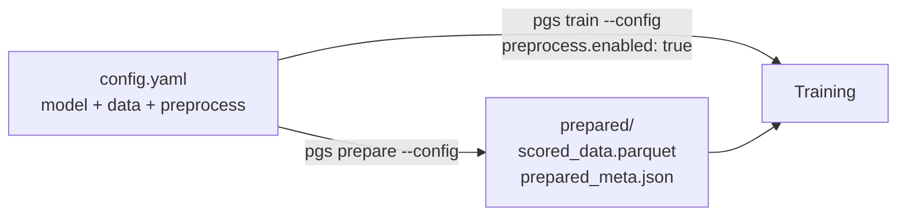

# Data Preparation

*Which samples you train on decides what the model gains and what it loses. `pgs prepare` measures every sample with the model you will train, so you can choose instead of guessing.*

---

## What preparation measures

For every sample, `pgs prepare` runs the model you are about to fine-tune over the conversation and records the perplexity of the tokens training will put loss on (the assistant turns). A low value means the model already writes this response almost verbatim; a high value means the response is far from what the model would write. It is a property of the (model, response) pair, not of the problem: a correct but unusual solution to an easy problem can score "hard".

What to select is an empirical question. The [measured results](#what-the-measurements-say) below are for post-trained Qwen3.5 models; compare any selection against a random subset of the same size on your own eval battery.

---

## The pipeline

=== "Config-driven (recommended)"

    One YAML drives everything. `pgs prepare` reads the **same config** you train with — the scoring model is `model.name_or_path`, the raw data is `data.dataset`, and the `preprocess:` section controls selection:

    ```bash
    pgs prepare --config configs/qwen35_4b/a100_80gb.yaml
    ```

    Then train — with `preprocess.enabled: true`, training automatically picks up the prepared parquet instead of the raw dataset:

    ```bash
    pgs train --config configs/qwen35_4b/a100_80gb.yaml --preprocess.enabled true
    ```

    The same `--section.field` overrides work here too:

    ```bash
    pgs prepare --config cfg.yaml --preprocess.budget 5000 --preprocess.strategy curriculum
    ```

=== "Standalone flags"

    The classic mode, no config file needed:

    ```bash
    pgs prepare \
        --model Qwen/Qwen2.5-3B-Instruct \
        --data my_data.jsonl \
        --output prepared/ \
        --budget 10000 \
        --format parquet
    ```

What this does, step by step:

1. **Score**: runs each sample through the target model, computes per-token perplexity using the model's own chat template to identify exactly which tokens are assistant responses
2. **Bucket**: assigns each sample to familiar / typical / unfamiliar by response-perplexity percentile (bottom 25% / middle / top 25% of *your* dataset under *your* model)
3. **Filter**: drops outliers by response perplexity, below `min_ppl` (1.5: near-verbatim answers) and above `max_ppl` (500: usually broken or wrong-language samples). Both are tunable defaults, not research findings
4. **Select**: keeps `budget` samples with the chosen `strategy` (see [Strategies](#strategies))
5. **Dump**: writes `scored_data.parquet` (order-preserving, fast to load) plus a `prepared_meta.json` manifest recording exactly which model, dataset, and strategy produced it

The scoring uses the *exact same masking* as training: only assistant tokens are measured. System prompts and user turns don't count. A long system prompt therefore cannot make a short, familiar answer look unfamiliar.

---

## One config, closed loop

The preparation → training loop is fully wired through a single YAML. There is no way for the scoring model and the training model to drift apart, because they are the same field.


```mermaid
flowchart LR
    A[config.yaml<br/>model + data + preprocess] -->|pgs prepare --config| B[prepared/<br/>scored_data.parquet<br/>prepared_meta.json]
    A -->|pgs train --config<br/>preprocess.enabled: true| C[Training]
    B --> C
```

```yaml title="config.yaml (excerpt)"
model:
  name_or_path: Qwen/Qwen3.5-4B     # used for BOTH scoring and training

data:
  dataset: your-org/agentic-traces  # the RAW dataset to prepare
  max_seq_length: 16384             # same truncation in scoring and training

preprocess:
  enabled: true                     # training uses the prepared output
  output_dir: ./prepared/qwen35_4b
  format: parquet                   # parquet (default) or jsonl
  budget: 10000                     # samples to keep (0 = all)
  strategy: random                  # default; see Strategies below
  eval_holdout: 100                 # reserve a held-out eval set (never trained on)
```

!!! tip "Free held-out eval set"
    Set `eval_holdout: N` and prepare reserves N random samples (drawn **after** outlier filtering, **before** budget selection) into `eval_data.parquet`. They are guaranteed disjoint from the training data. If `data.eval_dataset` is left empty, training picks this file up automatically — giving you a genuine same-distribution eval, so `eval/loss`, `eval/ppl` and `eval/gap` actually measure generalization instead of memorization.

!!! tip "Provenance travels with the data"
    Every prepare run writes `prepared_meta.json` next to the data: scoring model, source dataset, strategy, sample count, perplexity statistics, the familiarity distribution and, with `group_field: source`, a per-source profile before and after selection (public mixtures differ a lot per source, and any perplexity-based selection mostly changes the source mix). Training logs this manifest at startup, so every run records exactly which preparation produced its data.

!!! warning "No silent fallback"
    If `preprocess.enabled: true` but nothing has been prepared yet, training **fails immediately** with the exact command to run. It will never silently fall back to the raw dataset.

Two details worth knowing:

- **Curriculum ordering survives.** With `strategy: curriculum`, samples are stored familiar→unfamiliar and training skips shuffling so the ordering reaches the model intact. Every other strategy shuffles normally.
- **Parquet is the default** because it preserves sample order, loads far faster than JSONL, and is consumed directly by the training data loader (you can point `data.dataset` at any `.parquet` file or prepared directory manually, too). If your samples have a schema Arrow can't unify, the writer falls back to JSONL automatically.

---

## Strategies

`strategy` only matters when `budget` is set (below the pool size). Buckets are percentiles of response perplexity *of your dataset under your model*: familiar (bottom 25%), typical, unfamiliar (top 25%).

| Strategy | What it does | Evidence |
|----------|--------------|----------|
| `random` (default) | Uniform random subset (seeded) | The baseline every other strategy must beat. |
| `optimal` | J-shaped mix: 20% familiar / 50% typical / 25% unfamiliar / 5% most unfamiliar above 10K samples; 25/50/20/5 from 2K to 10K; 35/50/15/0 below 2K | A heuristic of ours, loosely after two papers that test neither mixtures nor these thresholds (2605.12906: single-difficulty subsets of base math models; FLOW, 2502.02797: loss re-weighting). **Measured below `random`** (see below). |
| `flow` | The lowest-perplexity (most familiar) samples | Named after FLOW, which *re-weights* the loss by exp(−loss/τ); palingenesis records that weight as `_score_flow_weight` but training does not use it, so this is plain "most familiar N" selection. |
| `curriculum` | A random subset, ordered familiar→unfamiliar; training keeps the order | Not measured. |
| `balanced` | Equal thirds of familiar / typical / unfamiliar | Not measured. |
| `medium_focus` | The samples closest to the median perplexity | Not measured. |
| `hard_focus` | The highest-perplexity samples | Not measured. |

Within a bucket samples are drawn at random, never in file order (concatenated datasets are grouped by source, so a first-N pick would silently select sources). If a bucket is short, the shortfall is backfilled from the others so you always get the full budget.

## What the measurements say

One controlled study, so read it as evidence for one setting, not as a law: **Qwen3.5-0.8B** (the post-trained hybrid checkpoint, non-thinking), fine-tuned on **4,000 math conversations** for 2 epochs (LR 1e-5 cosine, 32 conversations/step, full fine-tuning); only the data changes between runs. Evaluated with sampling on GSM8K, MATH-500, IFEval, MMLU-Pro, HumanEval+, MBPP+ and a chat sanity check; differences are paired per item against the untouched model.

| Data (4,000 conversations) | GSM8K | MATH-500 | IFEval | MMLU-Pro | HumanEval+ |
|---|---|---|---|---|---|
| untouched model | 56.3 | 40.8 | 56.7 | 31.8 | 28.7 |
| random subset, dataset (GPT-4o) solutions | −1.7 | −6.3 | −23.2 | −1.0 | −10.4 |
| `optimal` (J-mix) subset | −4.2 | −8.3 | −25.9 | −1.2 | −14.3 |
| most familiar 20% (≈ `flow`) | +0.5 | −8.4 | −23.1 | +1.2 | −8.8 |
| same prompts, dataset solutions | −0.5 | −6.8 | −28.5 | −1.6 | −5.8 |
| same prompts, **the model's own verified solutions** | +1.4 | +1.8 | −17.5 | +1.1 | −3.0 |
| random subset at LR 2e-6 instead of 1e-5 | −3.7 | −3.8 | −11.3 | −3.1 | −7.9 |
| random subset + 4,000 general chat conversations | −3.4 | −6.7 | −18.9 | −3.4 | −11.9 |
| random subset + the same 4,000 chat prompts **answered by the model itself** | −2.9 | −6.6 | −10.2 | +2.4 | −1.8 |

Standard errors of a single cell are about 1.3 (GSM8K, MMLU-Pro), 2.1 (MATH-500), 2.4 (IFEval) and 3.5 (HumanEval+); two training seeds of the same data differ by up to 3 points. Every row averages two seeds except the LR 2e-6 row and the last row (one seed each).

What this supports:

- **Selection by perplexity did not help.** No strategy beat a random subset on the target skill, and `optimal` was worse than random on GSM8K (−2.4 ± 1.1) and HumanEval+ (−4.0 ± 1.8), consistently across both seeds. Hence `random` is the default.
- **The score is not difficulty.** On 20,000 NuminaMath problems, the Spearman correlation between the model's pass rate (4 samples) and the response perplexity of the reference solution was 0.009. Selecting the problems the model solves sometimes (pass rate between 0 and 1) did not help either.
- **Where the responses come from matters more than which samples you pick.** On identical prompts, the model's own verified solutions (sample 4 answers, keep a correct one) beat the dataset's solutions by +8.6 ± 1.7 on MATH-500, +11.0 ± 1.8 on IFEval and +2.7 ± 1.1 on MMLU-Pro (two seeds each). They did not *raise* math above the untouched model, though: at this scale they preserve the skill rather than improve it. The dataset solutions are much shorter than what the model writes, and the model learns that: its MATH-500 answers shrink from ~1,250 to ~460 tokens and its accuracy drops. The price: the model keeps its habit of long answers that sometimes never terminate (chat sanity −7.5 ± 1.6 and MBPP+ −3.4 ± 1.8 vs dataset solutions).
- **Forgetting is the main effect, and data selection does not fix it.** Every run lost 11–29 points of IFEval. A 5× lower learning rate halved the IFEval loss (−11.3 vs −23.2) but still gave no math gain; mixing in an equal amount of general chat data recovered only +4.3 ± 1.7, because that chat data itself costs IFEval when trained alone (−20.9).
- **Replay the model's own answers, not a dataset's.** Answering the same 4,000 general prompts with the model itself (sampled once, unfinished answers dropped) and mixing them in instead of the dataset's answers kept +8.7 ± 2.3 IFEval, +6.2 ± 1.4 MMLU-Pro and +9.1 ± 3.4 HumanEval+ more (one seed). It does not protect the target skill: that depends on where the target responses come from (above). To do this in palingenesis, generate the answers with vLLM and add them as a second `data.sources` entry; `pretrain_replay_dataset` replays raw text, which we did not test.

What it does not show: other model sizes, thinking mode, base (non-instruct) models, larger budgets, or skills other than math. On base models the cited papers find harder data more useful as the budget grows (2605.12906). Before relying on any selection, run the same comparison against `random` on your own model and eval battery.

---

## Semantic packing (TFP)

TFP (Threshold Filtering Packing, Dong et al. 2024) orders samples so that related but not identical conversations end up adjacent, then packed into the same sequence, where each one serves as an implicit demonstration for the next. That mechanism needs packed documents to attend to each other. palingenesis keeps every packed conversation isolated (a document never sees the one before it; see [packing](../getting-started/first-training.md#packing-when-to-use-it)), so a TFP ordering changes nothing the model sees and is not part of the pipeline. `palingenesis.tfp.compute_tfp_ordering` remains available as a standalone utility for data exploration.

---

## Multi-source mixing

Real projects have multiple data sources: agentic traces, general instruction-following, code, reasoning. Each overfits at a different rate.

```yaml title="sources.yaml"
- dataset: ./agentic_traces.jsonl
  name: agentic
  weight: 0.65

- dataset: ./general_instruct.jsonl
  name: general
  weight: 0.20

- dataset: ./code_verified.jsonl
  name: code
  weight: 0.15
```

```bash
pgs prepare-multi --model Qwen/Qwen3.5-4B --sources sources.yaml --output prepared/
```

How the mix behaves in training (`data.sources`):

- `weight` is a **per-conversation** sampling probability, not a token share: a source of long conversations contributes more tokens than its weight suggests.
- An epoch ends when the **first** non-empty source runs out, so a small source with a large weight shortens the epoch for all the others.

!!! warning "`data.msft_tracking` has no effect yet"
    `msft.AdaptiveSourceTracker` (per-source weight decay when a source's validation loss rises, after mSFT, arXiv:2603.21606) exists but is not wired into the training loop. Setting `msft_tracking: true` logs a warning and the weights stay fixed. Watch per-source losses with `eval_sources` instead.

---

## What gets loss (SFT masking)

A sample is one of two shapes, and each is scored differently:

- **`{"text": "..."}` (pretrain / raw LM):** *every* token gets loss. There is no masking — the whole string is next-token prediction. Selected per source with `mode: pretrain` + `text_field`.
- **`{"messages": [...]}` (SFT / chat):** only **assistant** tokens get loss; system and user turns are masked out. Selected with `mode: sft` (the default) + `messages_field`.

!!! warning "Don't feed a rendered conversation as `text`"
    A full ChatML string (`<|im_start|>user…assistant…`) shoved into a `text` field trains on the *entire prompt* — question included — because pretrain mode masks nothing. For "loss only on the answer," use `messages` + `mode: sft`.

### How assistant tokens are located

Palingenesis masks purely from the model's own chat template, two ways:

1. **Fast path** — templates with a `` span expose Hugging Face's native assistant mask; that mask defines the trained tokens exactly.
2. **Turn-marker path** — templates without a generation span (Qwen3/3.5, Llama 3, ...). The assistant header and end-of-turn marker are derived from the template itself by rendering probe conversations; each assistant turn is then everything between its header and its end-of-turn token in the rendered string, found via offset mapping. That includes text the template renders from other fields, such as tool calls, and the end-of-turn token (the model learns to stop). Only the final render is used, with **no prefix-consistency assumption**, so it stays correct for templates that rewrite history — e.g. Qwen3.x dropping `<think>` from past turns. Templates without special-token markers fall back to locating each turn's text.

Per-message flags (`"loss": false`) and the `tools` field are honoured on both paths (see the [agentic guide](agentic-training.md)).

Both paths honor the same two knobs, identically:

| Option | Effect |
|--------|--------|
| `train_on_reasoning` (default `true`) | `true`: loss on the `<think>` block **and** the answer (distils reasoning). `false`: loss only on the post-`</think>` answer — the reasoning is stripped even when the template's generation span encloses it. |
| `last_turn_only` (default `false`) | Loss only on the **final** assistant turn; earlier assistant turns are masked. Use when earlier turns are a fixed context you must not fit — e.g. n-shot MCQA exemplar answers. No-op for single-turn data. |

An **empty** `<think>\n\n</think>` scaffold (as Qwen fast-format emits) carries no reasoning, so nothing inside it is trained regardless of `train_on_reasoning`; loss lands on the answer + terminator.

Both are set globally under `data:`. `last_turn_only` can additionally be overridden per source (in `sources` and `eval_sources` entries); `train_on_reasoning` is global-only.

### Reasoning in the data: fields, baked blocks, tags

An assistant turn's reasoning can come as a field (`reasoning`, `reasoning_content` or `think`) or baked into the content, as a block that **opens** the message. A baked block is moved into the reasoning field, so the template renders it exactly once. Templates that put an empty `<think>\n\n</think>\n\n` in front of turns without reasoning never add one before the baked block. If a row has both a field and a baked block, the field wins. Think tags later in the answer are text: they are rendered as written and trained. Templates that do not render reasoning at all (e.g. SmolLM2) get the content back verbatim.

| Option | Effect |
|--------|--------|
| `think_tags` (default: the template's) | Delimiters of the baked blocks, e.g. `["[THINK]", "[/THINK]"]`. By default they are read off the chat template (`<think></think>` for Qwen3.x, GLM, MiniMax; `[THINK][/THINK]` for Magistral-style templates), else `<think></think>`. Masking always uses the template's own tags, so data written with another model's tags (e.g. `◁think▷◁/think▷`) is converted to this model's format. |
| `chat_template_kwargs` (default `{}`) | Template kwargs for every row, e.g. `{enable_thinking: true}`. A row's own `chat_template_kwargs` column overrides them key by key, so thinking and non-thinking rows mix in one dataset. |

Both can be overridden per source (`sources` entries). A source's `chat_template_kwargs` is merged over the global kwargs. Agent-trace distillation sources take `think_tags` too.

```yaml
data:
  think_tags: ["<think>", "</think>"]        # optional: the student template's by default
  chat_template_kwargs: {enable_thinking: true}
  sources:
    - {dataset: data/reasoning.parquet, weight: 0.7}
    - {dataset: data/chat.parquet, weight: 0.3, chat_template_kwargs: {enable_thinking: false}}
    - {dataset: data/kimi_traces.parquet, weight: 0.2, think_tags: ["◁think▷", "◁/think▷"]}
```

---

## Pre-tokenized cache

By default every sequence is tokenized, masked, mixed and packed **on the fly**, every epoch. When the exact step count is needed for the LR schedule (epoch mode, `max_steps` unset), the pipeline is also scanned once up front — which pays the tokenization cost twice on the first epoch.

`pretokenize` fixes both: it runs the whole assembly **once**, dumps the final tensors to disk, and on every later run loads them directly.

```yaml
data:
  pretokenize: true
  pretokenize_path: ./pretokenized   # train.parquet + pretokenized_meta.json
```

What you get:

- **No per-step tokenization** — the cached rows are the final `input_ids` / `labels` / `attention_mask` (plus `position_ids` when packed). The trainer just reads and collates them. With `packing: false`, length-grouped batching (`length_group_buffer`) is still re-applied at load time, so the cache keeps the pad-token throughput win.
- **Cheap exact step count** — the count scan reads pre-tokenized arrow instead of re-tokenizing, so you keep an exact LR horizon without the up-front cost.
- **Automatic invalidation** — a fingerprint over the tokenizer, chat template, `max_seq_length`, `packing`, every source (path + size + mtime + weight + mode + fields + `last_turn_only`), `train_on_reasoning`, `turn_scaling`, `include_observations`, `seed` and replay is stored in `pretokenized_meta.json`. Change any of them and the cache is rebuilt — you can never silently train on a stale tokenization.

The cache is a **static** stream, so `msft_tracking` (which adjusts per-source weights *during* training) is rejected at validation time with a clear error. Disable one of the two to proceed. Under multi-GPU, rank 0 builds the cache once and the other ranks wait on a barrier, then each rank reads a disjoint shard.

---

## Validation data

Always, always, always have validation data. The simplest form is a single held-out set:

```yaml
data:
  eval_dataset: my_data.jsonl
  eval_split: test
  eval_samples: 200
  eval_every: 50
```

Without it:
- No best-model tracking (you get the last checkpoint, which may be overtrained)
- No early stopping signal
- No MSFT source-level monitoring
- No RL-readiness entropy tracking

With it: palingenesis continuously evaluates and saves the best checkpoint. The cost is negligible (200 samples, no gradient, every 50 steps ≈ 2 seconds of overhead per hour of training).

### Per-capability eval (`eval_sources`)

A single mixed `eval_dataset` gets token-dominated by whichever source has the longest sequences, so one number hides per-capability regressions. `eval_sources` scores each source **independently** and combines them into a weighted composite that drives best-model tracking (logged as `eval/<name>/loss` + `eval/loss`):

```yaml
data:
  eval_every: 50
  eval_sources:
    # raw-text language modeling — all-token CE/perplexity, no chat template
    - name: lm
      dataset: ./eval/heldout_docs.jsonl
      split: test
      mode: pretrain          # {"text": "..."}
      text_field: text
      weight: 0.4
      samples: 200
    # chat/MCQA proxy — assistant-only CE
    - name: mcqa
      dataset: ./eval/mcqa_heldout.jsonl
      split: test
      mode: sft               # {"messages": [...]}
      messages_field: messages
      last_turn_only: true    # score only the final answer (n-shot prefix ignored)
      weight: 0.6
      samples: 100
```

Per-source keys: `name`, `dataset`, `split`, `weight` (composite importance), `samples` (subset size), `regression_floor` (optional alarm), and **`mode`**:

- **`mode: pretrain`** (+ `text_field`): raw-text, all-token CE/ppl, no chat template. Matches how CPT actually trains, so the number is a true next-token perplexity. Use it for held-out LM text.
- **`mode: sft`** (default, + `messages_field`, optional `last_turn_only`): chat-templated, assistant-only CE. Use for genuine chat/MCQA tasks.

!!! warning "Measure raw LM as `text`, not as a fake assistant turn"
    Wrapping plain LM text in an `{"role": "assistant"}` message conditions perplexity on the chat-template scaffolding and no longer measures raw next-token LM. Use `mode: pretrain` with `text_field` instead.

---

## The cardinal rule

> Measure what you lose, not only what you gain.

Fine-tuning a post-trained model on one skill costs it others, and a loss curve shows none of it. Keep a small regression battery (instruction following, knowledge, code, plain chat) next to your target eval, and compare every data choice against a random subset of the same size.
